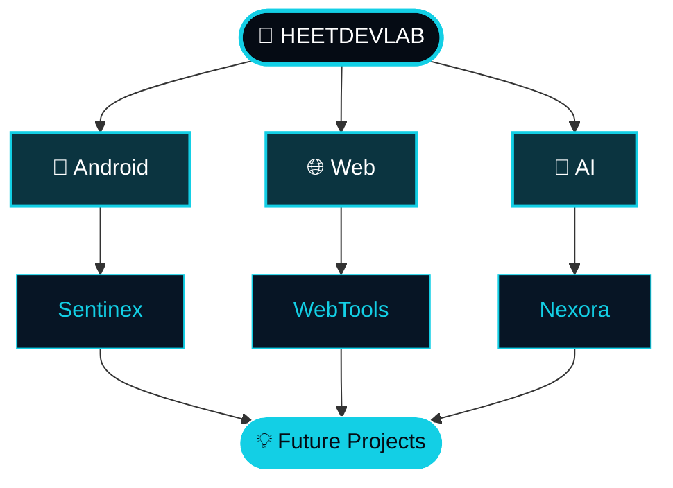
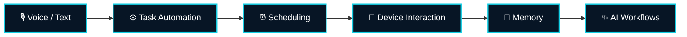
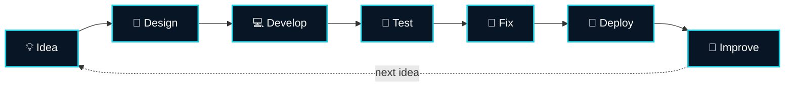

<div align="center">


<br>

<a href="https://heetdevlab.github.io/">

</a>
<a href="https://github.com/HeetDevLab">

</a>
<a href="https://youtube.com/@heetplayscode">

</a>

<br><br>


</div>


<div align="center">

### ⚡ A small developer brand built around one simple idea

# `Build  •  Learn  •  Improve  •  Repeat`

</div>


## 🌐 What is HeetDevLab?

**HeetDevLab** is my independent developer brand where I build, experiment with and showcase software projects.

The website brings my Android applications, browser utilities, development articles and personal portfolio together in one place.




## ✨ Explore the Ecosystem

<div align="center">

| Project | Description | Status |
|:---:|:---|:---:|
| 📱 **Sentinex** | Privacy-focused Android application | 🟢 Active |
| 🛠️ **WebTools** | Browser-based utility collection | 🟢 Active |
| 📝 **Blog** | Development & project articles | 🟢 Active |
| 👨‍💻 **Portfolio** | Personal developer portfolio | 🟢 Active |
| 🤖 **Nexora** | AI assistant project | 🟡 In Development |

</div>


## 📱 Sentinex

**Sentinex** is a privacy-focused Android application built around app protection and useful privacy-oriented features.

<div align="center">

| 🔒 App Lock | 👤 Intruder Detection | 👻 Ghost Mode | 🔢 PIN Protection | 🛡️ App Protection |
|:---:|:---:|:---:|:---:|:---:|

<br>

<a href="https://heetdevlab.github.io/Sentinex/">

</a>

</div>


## 🛠️ WebTools

A collection of lightweight browser-based utilities.

<details>
<summary><b>🔽 Click to see all tools</b></summary>

<br>

| Tool | Purpose |
|---|---|
| 🔑 Password Generator | Generate strong passwords |
| 🔢 PIN Generator | Generate secure PINs |
| 📝 Secure Notes | Browser-based notes |
| #️⃣ Hash Generator | Generate hashes |
| 🔍 Hash Compare | Compare hash values |
| 🔐 JWT Tools | Work with JWTs |
| 🛡️ Password Strength | Check password strength |

</details>

<div align="center">

<a href="https://heetdevlab.github.io/WebTools/">

</a>

</div>


## 📝 Blog

The HeetDevLab blog documents:

- 📱 Android development
- 🔐 Privacy-focused software
- 🧱 Independent project building
- 🧪 Development experiments
- 💡 Lessons learned while creating software

<div align="center">

<a href="https://heetdevlab.github.io/Blog/">

</a>

</div>


## 👨‍💻 Portfolio

My developer profile, skills, projects and development journey in one place.

<div align="center">

<a href="https://heetdevlab.github.io/portfolio/">

</a>

</div>


## 🤖 Nexora

**Nexora** is an AI assistant project currently in development.



> 🚧 **Nexora is a work in progress.**


## ⚙️ Tech Stack

<div align="center">


<br><br>


</div>


## 📂 Repository Structure

<details>
<summary><b>🔽 Click to expand</b></summary>

```text
HeetDevLab.github.io/
│
├── index.html
├── style.css
├── script.js
│
├── Sentinex/
├── WebTools/
├── Blog/
├── portfolio/
├── assets/
│
├── favicon.png
├── icon.jpg
├── robots.txt
├── sitemap.xml
└── service-worker.js
```

</details>


## 🔄 How I Build




## 📊 GitHub Activity

<div align="center">


<br><br>


<br><br>


<br>


</div>


## 🌱 Currently Exploring

<div align="center">


</div>


## 🔗 Explore HeetDevLab

<div align="center">

<a href="https://heetdevlab.github.io/Sentinex/">

</a>
<a href="https://heetdevlab.github.io/WebTools/">

</a>
<a href="https://heetdevlab.github.io/Blog/">

</a>
<a href="https://heetdevlab.github.io/portfolio/">

</a>

</div>

<br>

<div align="center">

### 💙 Thanks for visiting HeetDevLab

**Building ideas into software, one project at a time.**


</div>
